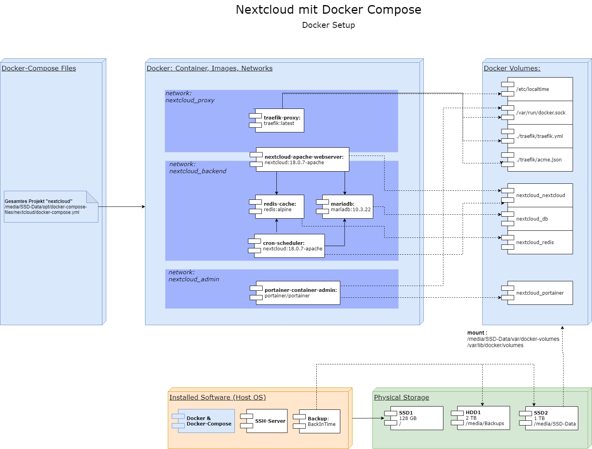
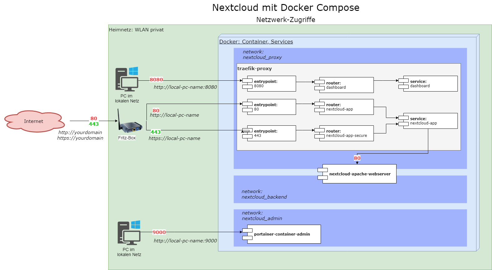

# What is it? Nextcloud all-in-one package with Docker-Compose

#### Background:
I am running an Nextcloud-Server since 2016 now. While my masters exam in 2020 I migrated the setup to a cloud-native technology stack.
Nextcloud itself offers several examples for docker-compose setups. But anyhow I could not find one that fits my needs:

* Enhanced Logging and Monitoring features with Grafana dashboards and Loki as log-driver
* Portainer added directly in compose-file for container administration 
* Traefik instead of Nginx Proxy with Letsencrypt Companion -> 1 Container less, easier maintenance
* naming of containers, networks and volumes so it is clearly understandable
* easy configuration via a central env-file
* Manual / Tutorial incl. all necessary commands, for initial setup but as well for maintenance (updates, start, stop, backup)
* deliver the whole folder structure example
* (almost) no "custom" builds to be as much standard as possible for lower complexity (only needed for grafana to have more plugins)

Link to Original example on Github Account nextcloud/docker:
    https://github.com/nextcloud/docker/tree/master/.examples/docker-compose/insecure/mariadb-cron-redis/apache/

## Technologie-Stack 

#### Nextcloud-stack: Overview of Containers / Services / Images inkl. Links:
* Nextcloud with Apache Webserver
    https://hub.docker.com/_/nextcloud/
* Maria DB
    https://hub.docker.com/_/mariadb
* Traefik Proxy 
    https://hub.docker.com/_/traefik
* Cron Jobs
* Redis in-Memory Cache
    https://hub.docker.com/_/redis

#### Monitoring-stack: Overview of Containers / Services / Images inkl. Links:
* Portainer Container Management
    https://hub.docker.com/r/portainer/portainer-ce
* Prometheus - monitoring DB
    https://hub.docker.com/r/prom/prometheus
* Prometheus - node exporter
    https://hub.docker.com/r/prom/node-exporter
* Prometheus - Mysql exporter
    https://hub.docker.com/r/prom/mysqld-exporter
* Prometheus - Cadvisor
    https://hub.docker.com/r/google/cadvisor
* Prometheus - Redis exporter
    https://hub.docker.com/r/oliver006/redis_exporter
* Grafana - monitoring dashboards and logviewer
    https://hub.docker.com/r/grafana/grafana
* Grafana-Loki log collector
    https://hub.docker.com/r/grafana/loki

#### Infrastructure-diagrams

	containers, volumes, networks and mounts:

 

networking in detail:

# Step-by-Step manual / tutorial for initial setup

#### install ubuntu
    - download 20.04.01
	- download rufus portable -> create bootable USB Stick
	- deutsch, install
	- Keyboard: German, German
	- minimal Installation, get OS Updates, get Codecs and drivers 
	- Installationsart / Partitionierung -> "etwas anderes"
		1 SSD klein -> HostOS inkl. Bootloader mit ext4 und Mount "/"

#### initial config
	- establish live Patch -> Ubuntu login
	- keine Fehlerberichte
	- keine Ortung
	- Anzeigeger�te -> Display-Aufl�sung
	- install updates + restart

#### file system 
	- App "Laufwerke �ffnen" -> Dateisysteme umbenennen, falls notwendig automatische mounts setzen

#### install SSH-Server and test connection
	sudo apt-get install openssh-server
	sudo service ssh status
	connection test via bitvise client

#### install Backintime (root) via "Ubuntu Software" 

#### install Docker 
-> https://docs.docker.com/engine/install/ubuntu/
	
	sudo apt-get update
	
	sudo apt-get install \
    apt-transport-https \
    ca-certificates \
    curl \
    gnupg-agent \
    software-properties-common
		
	curl -fsSL https://download.docker.com/linux/ubuntu/gpg | sudo apt-key add -
	sudo apt-key fingerprint 0EBFCD88
	
	
		sudo add-apt-repository \
	   "deb [arch=amd64] https://download.docker.com/linux/ubuntu \
	   $(lsb_release -cs) \
	   stable"
   
    sudo apt-get update
	sudo apt-get install docker-ce docker-ce-cli containerd.io
	sudo docker run hello-world
    
#### install compose  
-> https://docs.docker.com/compose/install/

	sudo curl -L "https://github.com/docker/compose/releases/download/1.26.2/docker-compose-$(uname -s)-$(uname -m)" -o /usr/local/bin/docker-compose
	sudo chmod +x /usr/local/bin/docker-compose
	sudo ln -s /usr/local/bin/docker-compose /usr/bin/docker-compose
	docker-compose --version

#### install htpasswd
	apt-get update
	apt-get install apache2-utils

if already existing and only migrating to a new host -> recover var and opt folders

#### install loki log driver for centralized logging in grafana
	sudo docker plugin install grafana/loki-docker-driver:latest --alias loki --grant-all-permissions

#### change Configs for your setup -> Domain-name, mail for SSL, passwords etc.
	opt/docker-compose.env
	opt/docker-compose-files/nextcloud/traefik/traefik.yml
	var/docker-volumes/nextcloud_nextcloud/_data/config/config.php

#### mount volume:
	sudo mount --bind /media/SSD-Data/var/docker-volumes /var/lib/docker/volumes

#### configure traefik container
    chmod 600 /media/SSD-Data/opt/docker-compose-files/nextcloud/traefik/acme.json

#### create networks manually
	sudo docker network create nextcloud_proxy
	sudo docker network create nextcloud_backend

#### if data has to be migrated, www-data must be owner of the nc volume
	cd /media/SSD-Data/var/docker-volumes/nextcloud_nextcloud/_data/
	chown -R www-data:www-data * 
    
#### Test run:
    sudo bash /media/SSD-Data/opt/scripts/nextcloud_start.sh
	
	Trafik 
		call URL in browser http://hostname_internal:8080
		have a look at service status -> no errors should be displayed
	
	Portainer 
		call URL in browser https://hostname_internal:9001 or http://hostname_internal:9000
		create admin user, connect local runtime
		have a look at running containers -> no errors should be displayed
	
	Nextcloud internal and external
		call URL in browser https://hostname_internal or http://hostname_internal
		call URL in browser https://hostname_external or http://hostname_external
	
		
#### Optimizations
	sudo docker exec -u www-data nextcloud-apache-webserver php occ db:add-missing-indices
	sudo docker exec -u www-data nextcloud-apache-webserver php occ db:convert-filecache-bigint
	sudo docker exec -u www-data nextcloud-apache-webserver php occ db:add-missing-columns

#### Data migration
- Documents
- calendar
- contacts
- Lists / tasks

#### connect Clients 
- Browser
- Windows
- iOS / Android

#### Initial Nextcloud setup
- configure Mailing -> SMTP Server etc. , so admin Mails can be sent
- save all passwords in a password save e.g. Keypass 
	DB
	OS
	...
- Install App Admin Quota , aktivate, configure
- init backup with backintime and as tar-files
- router e.g. Fritz-Box setup
	open ports
	restart
	save config as file
- install and activate 2 Factor Login App / OTP for all users

## Links to other and more manuals, this explanation based on:
	https://goneuland.de/nextcloud-server-mit-docker-compose-und-traefik-installieren/#6_3_Nextcloud_komplett_auf_HTTPs_umstellen
	https://goneuland.de/traefik-v2-https-verschluesselung-sicherheit-verbessern/
	https://goneuland.de/traefik-v2-reverse-proxy-fuer-docker-unter-debian-10-einrichten/

# WIKI
	in the Wiki section you can find many useful commands for maintenance -> how to start, stop, update etc.
	
# Establish enhanced Monitoring and logging

#### Prometheus check
	call URL in browser https://hostname_internal:9091 or http://hostname_internal:9090
	have a look at targets section -> all the configured metrics data sources should be active and running

#### Prometheus exporter for mariadb needs an own db-user
	login to maria db
		sudo docker exec -it mariadb bash
		mysql -u root -pROOTPASSWORD
	
	the user "exporter" must be created with the password you set in env-file	
		CREATE USER 'exporter'@'%' IDENTIFIED BY 'nc-db-exporterpw' WITH MAX_USER_CONNECTIONS 5;
		GRANT PROCESS, REPLICATION CLIENT ON *.* TO 'exporter'@'%';
		GRANT SELECT ON performance_schema.* TO 'exporter'@'%';
		
	restart whole project
		sudo bash /media/SSD-Data/opt/scripts/nextcloud_restart.sh

#### Grafana initial setup
	call URL in browser https://hostname_internal:3001 or http://hostname_internal:3000
	login via admin:admin and change password
	create data source for prometheus -> http://mon_prometheus:9090
	create data source for loki -> http://loki:3100
	
#### Grafana Dashboards
	import all the dashboards from opt/docker-compose-files/monitoring/grafana

#### if needed: install more Plugins (visualizations) for Grafana dashboards
	Login to grafana container 
		sudo docker exec -it grafana-monitoring-dashboards bash
		grafana-cli plugins install grafana-piechart-panel
		exit
		docker container restart grafana-monitoring-dashboards

#### configure log-level in nextcloud
	install app Auditlog  
	change loglevel -> 	https://docs.nextcloud.com/server/latest/admin_manual/configuration_server/logging_configuration.html
		cd var/docker-volumes/nextcloud_nextcloud/_data/config/
				
## Links to other and more manuals, this explanation based on:
	https://teqqy.de/docker-monitoring-mit-prometheus-und-grafana/
	
	